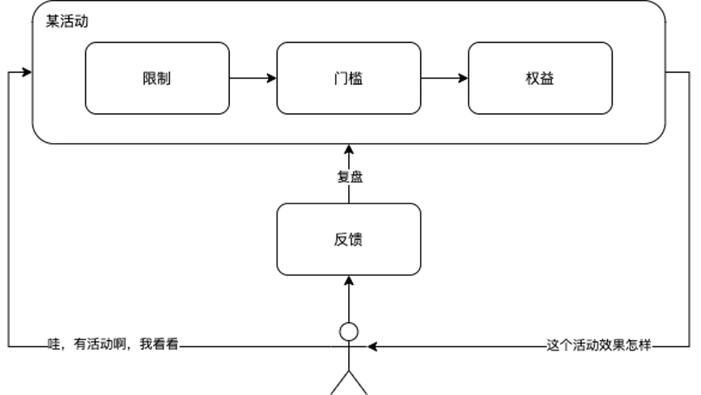

## 说在前面的话

距离饿了么（现在叫阿里本地生活）离职后，加入了哔哩哔哩做小程序底层基础建设，已经大概一年多没有写博客了，虽然没写，但是沉淀了很多好玩的东西，把一些思考和工具和大家分享出来～

讲领域切入设计这个话题，是因为之前我记得有个读者问过我2个问题：

1. 我们是 xxx 的，但是现在老大感觉后台比较复杂，耦合性高，硬代码太多，想让我们重构，但是我感觉不知道怎么做？根本无从下手。
2. 老大每天让我们做提效，讲究设计，还要根据业务进行设计，但是我只知道一些基础的设计模式，感觉没什么好做的，也不知道要做成什么样，太煎熬。

哈哈，这边先打个马虎眼，先不忙回答这个问题，先讲讲我身上的一个案例，最后再来回答这个问题。

## 切入主题

我在前端写了5年左右的业务从简单到复杂，然后再到简单，尤其在上家公司，贡献给营销3年的时光，和产品一起设计过，和研发一起重构过，和实际使用者线下调研沟通过，对营销这块有自己的一个摸索的想法，现在写下来供做营销相关的同学一起参考。

### 领域是什么？

营销。

### 什么是营销？

营销大家平常接触的就是卖东西，能联想到就是电商、活动等，但是这个只是一个浅显的大众认知，如果我们要去做一个好的设计，就必须去深入了解它，然后熟悉它，最后运用它。

#### 以下是一些专业定义概念的平台对营销的定义：

百度百科：指企业发现或发掘准消费者需求，让消费者了解该产品进而购买该产品的过程。    
美国市场营销协会（AMA）：营销是创造、沟通与传递价值给顾客，以及经营顾客关系以便让组织与其利益相关人（stakeholder）受益的一种组织功能与程序。

#### 通过概念我们知道营销的定义，我们了解了营销是什么，但是营销的目的呢？

通俗点讲就是：客户获得让利，企业获得利润。

专业一点就是：在一种利益之上下，通过相互交换和承诺，建立、维持、巩固与消费者及其他参与者的关系，实现各方的目的。

当然现代社会下，对营销的细分，乃至衍生都细化到了很深的程度，也有专业的人去做，所以我们就不深入去说概念，我们将核心点放到，摸索营销业务下的软件设计，如何结合业务进行代码软件设计。 常用做法

## 常用做法

我们一般接到业务的做法是，我们的现状有什么？需要设计什么样的数据模型？需要做什么样的逻辑？对以前的代码结构等等存在是否有影响？

我不否认的一点是，对于基础架构设计完毕之后，这样的做法确实没有什么问题，而且有时候需求需要快速上线或者刚接触项目不久，不是很懂，这样做也最符合常规，毕竟不会出问题才是最完美的。

但是作为一个自己以后可能需要长期维护、迭代下去的项目，如果不懂前人的设计，不停地堆代码下去，迟早一天会成为一个 "巨石" 应用，最后苦的还是自己（跑路就当我没说…）。 该怎么设计？

一般框架，只解决通用的一类事，类似于设计模式一样，可以用这些设计模式解决一些通用方案，但是针对一个业务领域的设计，一般人都不知道怎么去下手，下面以我对营销的理解直接进入主题。

## 领域思考

### 一句话总结

何时、何地、谁、怎样条件、获得什么、使用感受。

### 深入详细分析

* 何时：限制时间；
* 何地：限制地点或者渠道；
* 谁：限制什么样的人群；
* 怎样的条件：需要达到什么样的门槛；
* 获得什么：客户享受什么样的权益；
* 使用感受：营销的反馈；

### 第一层抽象：属性、规则、反馈。

    

这3个大概念上的模块，都是没有强耦合的，都可以单独设计，但是这3个太抽象，比如：

* 营销属性具体指什么，什么样的才能界定他是属性？
* 营销规则，具体指什么，一个规则算不算活动的属性？
* 以及营销感受跟前面更没有太搭界的地方，这属于后勤或者售后的工作？

就像有3个抽象类一样，什么都没有，就是定义了一个方向，最终实现，还是需要进行考虑和细化的。所以我们还要更细化的抽象。

所以根据我们上面的详细分析，

1. 虽然时间、地点、人群都是营销的属性，天然存在的，但是我们还要抽离出共性，这些属性不都是做的一些限制么？
2. 营销作为一个交换和承诺，当然也有一定的契约，这样的契约下，我们需要达到一定的门槛，才能获得契约约定的结果，从而获得到权益。
3. 有了限制，以及公示门槛和权益，完成营销的链路，但是这个营销到底怎么样，需要什么样的评估和反馈呢？亏本还是挣钱？大火还是寥寥无人？怎样反向优化营销。

### 第二层抽象：限制、门槛、权益、反馈

    

我们可以借助实际场景进行考虑，举例饿了么百亿补贴活动，自己作为用户是怎么消费这个营销活动的：

* 首先从一个渠道看到了有营销活动（活动预告），新闻呀，进入饿了么app看到的。
* 其次开始看这个营销活动在20年8月27日起，饿了么app里，在124个城市，可与红包和满减叠加，指定商户可以享受。（限制 - 时间、地点、场景、人群） 。
* 需要在达到商户的满减门槛。（门槛 - 打到满减门槛）。
* 可以享受百亿补贴的减免金额。（权益 - 得到百亿补贴的减免）。
* 感觉享受到优惠了，给个好评。（反馈 - 营销怎么样）。

其实这里的限制和门槛有点类似，至于是否可以合并每个人都有不同的想法，而我将他么分割的想法是这样的：

1. 首先营销活动本身的属性，其实都是为了解释营销的的一些具体描述，而这些描述虽然最终都会转化成营销活动的限制，但它的映射，最终是由营销的属性映射过来的。
2. 但是门槛这个规则，是从规则中衍生出来的，属于规则类的限制，而规则将是后期超级复杂的一块，将门槛归纳到限制中在我的设计中，违背了内聚的原则，所以我将它单独拆离出来。

归根结底，我们是通过第一层抽象继续细分下来的，所以第二层抽象，就是为了将属性和规则界定的更明显和清晰。

## 切入领域

我们将营销这块领域进行了深入了解，然后将这块领域以程序的思维进行抽象，那么我们这样就可以进行敲代码了么？当然不！！我们需要了解最核心的理念，我们为什么要将这块领域设计成这样？设计理念是什么？

### 设计初衷

复杂领域简单化。

### 设计理念

模块化、原子化。

营销是一块大领域，基于营销的及时性以及灵活性，我们需要我们的系统设计能够承载更多的变化、更快的响应速度、更加灵活的灵活性。所以，我用一把 “锤子” 直接把这块领域敲碎，只有碎成一块一块的，我们才能更灵活的去组装展现不同的面。

## 切入设计

我们切入领域进行了深度思考，从简单看到复杂，然后再从复杂思考到简单，下面做我们的代码设计（使用 node，大家参考设计思路就好了）。

### 代码结构目录：

    

### 池子

我们已经把领域打碎了，一颗一颗的都是小颗粒原子， 所以我们需要一个池子去盛放我们筛离出来的原子。所以我们需要设计一个池子里的各个数据模型。

#### 限制抽象池：pond/limit.js

```javascript
let limit = {
    // 时间
    time: null,
    // 地点
    address: null,
    // 人群
    people: null,
    // 渠道
    channel: null
}

class Limit {
    // 新增限制
    addLimit(key) {
        limit[key] = null
    }

    // 删除限制
    delLimit(key) {
        delete limit[key]
    }

    // 设置限制的一项值
    setLimitValue(key, value) {
        limit[key] = value
    }

    getLimit() {
        let _output = {}
        for (let key in limit) {
            if (limit[key] !== null) _output[key] = limit[key];
        }
        return _output
    }

}

module.exports = Limit;
```

#### 门槛抽象池：pond/rule.js

```javascript
let rule = {
    // 消费金额
    consumption: null,
    // 订单数量
    orderNumber: null
}

class Rule {
    // 新增限制
    addRule(key) {
        rule[key] = null
    }

    // 删除限制
    delRule(key) {
        delete rule[key]
    }

    // 设置限制的一项值
    setRuleValue(key, value) {
        rule[key] = value
    }

    getRule() {
        let _output = {}
        for (let key in rule) {
            if (rule[key] !== null) _output[key] = rule[key];
        }
        return _output
    }
}

module.exports = Rule;
```

#### 权益抽象池：pond/benefit.js

```javascript
let benefit = {
    // 减免金额
    money: null
}

class Benefit {
    // 新增限制
    addBenefit(key) {
        benefit[key] = null
    }

    // 删除限制
    delBenefit(key) {
        delete benefit[key]
    }

    // 设置限制的一项值
    setBenefitValue(key, value) {
        benefit[key] = value
    }

    getBenefit() {
        let _output = {}
        for (let key in benefit) {
            if (benefit[key] !== null) _output[key] = benefit[key];
        }
        return _output
    }
}

module.exports = Benefit;
```

#### 反馈抽象池：pond/feedback.js

```javascript
// 定义数据模型
// let feedback = {
//     // 反馈类型
//     type: null,
//     // 反馈消息
//     message: null
// }

// 缓存数据
let feedbackArr = []

class Feedback {

    // 设置限制的一项值
    setFeedback(options) {
        feedbackArr.push({
            type: options.type,
            message: options.message
        })
    }

    getFeedback() {
        console.log('>>>', feedbackArr)
        return feedbackArr;
    }

}

module.exports = Feedback;
```

这4个池子，将每个抽象进行了归类形象化，且每个类中对细节进行了原子管控，可以对抽象中的细节进行增删改查，这样就打碎了复杂的块，每个都是最小的一块，后面我们就可以将这些小块进行组装了。

### 组装

#### 组装工厂 ：factory/index.js

```javascript
/**
 * 组装更灵活可操作的活动
 *  - 该类依赖上游打散的数据集合
 *  - 该类将上游数据进行组合出新的活动类型
 * */

const Limit = require('../pond/limit')
const Rule = require('../pond/rule')
const Benefit = require('../pond/benefit')
const Feedback = require('../pond/feedback')

let _activity = [];

class Activity {
    constructor() {
        this._limit = new Limit();
        this._rule = new Rule();
        this._benefit = new Benefit();
        this._feedback = new Feedback();
        this._cache = {
            limit: {},
            rule: {},
            benefit: {},
            feedback: []
        }
    }

    getLimit() {
        return this._limit;
    }

    setLimit(obj) {
        this._cache.limit = obj;
    }

    getRule() {
        return this._rule
    }

    setRule(obj) {
        this._cache.rule = obj;
    }

    getBenefit() {
        return this._benefit
    }

    setBenefit(obj) {
        this._cache.benefit = obj;
    }

    getFeedback() {
        return this._feedback
    }

    setFeedback(key, obj) {
        _activity[key].feedback = _activity[key].feedback.concat(obj);
    }

    generate() {
        let _temp = Object.assign({}, this._cache);
        _activity.push(_temp);
        this._cache = {};
        return {
            id: _activity.length - 1,
            data: _temp
        };
    }

    getActivityList() {
        return _activity;
    }

}

module.exports = Activity;
```

组装工厂的代码，就是将所有的原子池子导入，然后绑定每个抽象池的原子，最终以一类的方式输出，然后对输出进行糅合，最终输出一个灵活配置的营销活动。最后当然是供上下游进行依赖或者消费。

组装工厂的意义就是类似于搭积木一样，每个小块自己可以随意灵活取用，可以拼凑出自己想要的任何模型，这样存在的意义就是，对于规则复杂高、形式高灵活场景，可以完全有把控力，下面我们来测试一下，对于复杂高，高灵活场景的一些case。

#### 测试：entry/index.js

##### case1 - 2011-11-11、所有人、满60减30（简单）

```javascript
// 运行于调试
const Activity = require('../factory/index')

// case 1： 2011-11-11 所有人 满60-30活动
let _case1 = new Activity();
// 设置限制
_case1.getLimit().setLimitValue('time', '2011-11-11');
_case1.getLimit().setLimitValue('people', 'all');
_case1.setLimit(_case1.getLimit().getLimit())
// 设置门槛
_case1.getRule().setRuleValue('consumption', 60);
_case1.setRule(_case1.getRule().getRule())
// 设置权益
_case1.getBenefit().setBenefitValue('money', 30);
_case1.setBenefit(_case1.getBenefit().getBenefit())

// 生成活动
let _res = _case1.generate();
// 模拟反馈
_case1.getFeedback().setFeedback({
    type: 'message',
    message: '哇塞，活动真优惠！'
})

_case1.setFeedback(_res.id, _case1.getFeedback().getFeedback());

console.log(_case1.getActivityList());
```

##### case1 - result

```JSON
[
  {
    "limit": {
      "time": "2011:11:11",
      "people": "all"
    },
    "ruleL": {
      "consumption": 60
    },
    "benefit": {
      "money": 30
    },
    "feedback": [
      {
        "type": "message",
        "message": "哇塞，活动真优惠！"
      }
    ]
  }
]
```

这是个简单的case，做了一些简单的活动场景配置，最常见的满减活动，当然针对满减还有更杂的，比如多梯度、补贴力度比等，这个可以更深入去看，下面看复杂的场景配置。

##### case2 - B站「919」活动（复杂模拟）

限制：2021-09-19、哔哩哔哩APP、安卓、注册用户、会员购渠道、主会场、手办类。   
规则：总订单满1W、前100名、60s内付款、下单金额满1000。   
权益：减免200、赠券500-100券。

```javascript
// 运行于调试
const Activity = require('../factory/index')

// case 2
let _case2 = new Activity();
// 设置限制
_case2.getLimit().setLimitValue('time', '2021-09-19');
_case2.getLimit().setLimitValue('address', '哔哩哔哩APP');
_case2.getLimit().setLimitValue('people', '已注册用户');
_case2.getLimit().setLimitValue('channel', '会员购');
_case2.getLimit().addLimit('platform');
_case2.getLimit().setLimitValue('platform', '安卓');
_case2.getLimit().addLimit('scene');
_case2.getLimit().setLimitValue('scene', '主会场');
_case2.getLimit().addLimit('category');
_case2.getLimit().setLimitValue('category', '手办');

_case2.setLimit(_case2.getLimit().getLimit())
// 设置门槛
_case2.getRule().setRuleValue('orderNumber', '10000');
_case2.getRule().addRule('sort');
_case2.getRule().setRuleValue('sort', '100');
_case2.getRule().addRule('payTime');
_case2.getRule().setRuleValue('payTime', '60');
_case2.getRule().setRuleValue('consumption', '1000');
_case2.setRule(_case2.getRule().getRule())

// 设置权益
_case2.getBenefit().setBenefitValue('money', 200);
_case2.getBenefit().addBenefit('coupons');
_case2.getBenefit().setBenefitValue('coupons', '满500-100券');
_case2.setBenefit(_case2.getBenefit().getBenefit())

// 生成活动
let _res = _case2.generate();
// 模拟反馈
_case2.getFeedback().setFeedback({
    type: 'message',
    message: '哇塞，抢到了，不过有点难抢哦！'
})

_case2.setFeedback(_res.id, _case2.getFeedback().getFeedback());

console.log(_case2.getActivityList());
console.log(JSON.stringify(_case2.getActivityList()));
```

##### case2 - 结果

```javascript
[{
    "limit": {
        "time": "2021-09-19",
        "address": "哔哩哔哩APP",
        "people": "已注册用户",
        "channel": "会员购",
        "platform": "安卓",
        "scene": "主会场",
        "category": "手办"
    },
    "rule": {
        "consumption": "1010000",
        "sort": "100",
        "payTime": "60"
    },
    "benefit": {
        "money": 200,
        "coupons": "满500-100券"
    },
    "feedback": [{
        "type": "message",
        "message": "哇塞，抢到了，不过有点难抢哦！"
    }]
}]
```

这个营销场景就相对比较复杂，限制条件比较多，规则门槛和权益都不单一，但是在这样的场景下，我们依然可以通过只需要改上层应用层代码，就能呈现出复杂场景，而不需要修改底层设计，也自然而然的能够支撑更复杂的业务场景。

当然，这上面的示例代码使用的是前端的node开发的，但是对于后端（深耕营销领域的）来说，也可以参考设计思维和方式，将抽象的想法和模型落实到后端的数据库表结构设计、将组装代码用后端语言进行组装（Java、go等），最终提供出灵活的营销底层设计方案。对于产品职责的，将设计思路归纳到产品规划中，针对营销进行整个逻辑全盘控制，限制、门槛、权益、反馈形成整体流程的闭环，从产品的设计上线、用户使用、反推搜集、正向推进产品改进，每个节点进行深入，更专业，也能从中找到突破点，打造更爆款、更双赢的营销。

## 问题解答

所以，最后我们回到上面的问题，来进行回答：

### 问题一

我们是 xxx 的，但是现在老大感觉后台比较复杂，耦合性高，硬代码太多，每次开发都鼓捣很久，还会出现很多千奇百怪的bug，想让我们重构，但是我感觉不知道怎么做？根本无从下手。

### 解答

1. 首先深入领域，抛开代码，明确自己是做什么的，然后对这一块领域进行理解、梳理、归纳，达到懂和透彻的感觉（毕竟重构也不是一开始就推动下去的，也需要做很多前期调研等）。
2.
在懂和透彻的感觉基础上，再结合现阶段项目运行中存在的一些问题进行一些发散的思考，这些问题引起的具体乃至根本原因是什么？因为这些问题最终暴露在你的项目中，从这些不足中去反推项目中存在的问题（比如哪些灵活性、可维护性、耦合度等等各方各面）。
3. 基于 了解领域 + 深度思考，最终将所有的结论进行归纳总结，先抛开个方面的因素，我们如果要从头去做这个项目，基于领域的特性和思考的目标，如何去做这个设计，进行深度探讨，做抽象设计等等
4.
了解代码，迭代里很久的代码，虽然打了很多补丁，有时候运行起来又很繁琐，但是确实是在设计运行中，发现了很多不足，不管是code阶段还是代码设计，乃至产品设计方案中，这些补丁将这些问题进行了修复，so，好好善待这些补丁，毕竟是上一个系统的经验，可以在新方案中吸收进去。
5. 脑爆 + 雏形，这个阶段对于搜集的第一手经验已经很丰富，可以开始将各种抽象和开放脑洞的想法进行归类和糅合，形成自己初级阶段的雏形。这里的雏形是最重要的，因为这是方向和骨架，只有确定，后面才能将这些东西进行丰富，形成自己的架构和项目。
6.
借人，如果有空，可以将你的方案拉个会议进行探讨，借助更多人的脑袋进行思考和优化一遍，因为每个人的经验和想法都不一样，都会带给自己往更好的方向去雕刻这个雏形。最初阶段的雕刻和修改是最容易的，因为不会引发太多的「蝴蝶效应」，但是在上层完全搭建完毕后，这样的结果是不可接受的，因为你会拿更多的补丁去覆盖你上次的补丁，这样对架构的破坏是更永久和致命的。
7. 有了明确的方向和设计，下面就可以将你的想法和架构进行丰满，这个阶段，有想法、有设计、有方向、有架构，行动起来就感觉像一气呵成，恨不得今天就搭建完毕。
8. 后面就是正常的软件生命周期的流程了，测试验证，细节修改等，就不详细说了。


如何设计简单流程

### 问题二

老大每天让我们做提效，讲究设计，还要根据业务进行设计，但是我只知道一些基础的设计模式，感觉没什么好做的，也不知道要做成什么样，太煎熬。

### 解答

1.
首先明确一个问题，什么是设计？在我的理解里，设计是为了规范行为、统一行动、高效理解、有迹可循。特别在大公司里，大家都会争夺核心业务，只有手上握着更多业务更多资源，对于自己的组或者老大就有更多资源（HC、年终奖等）和话语权。基于这样的核心目标下，设计的优势就完美体现，不言而喻了。逼叨叨一句，其实小公司也一样，只是偏向的目标不一致：快、更快上线，抢占更多市场。
2.
第二点为什么要设计，要做成什么样？其实设计并没有想象的那么高大上，不是说我要把我们整个项目都推翻重做，从头再来。想法是好的，但是一般不可能给那么多时间和资源去给你搞的。设计也可以是很小的，在代码上，比如这段代码在xx场景下太消耗性能，导致整体速度下降，你优化掉，这也是设计；在业务上，这样的场景，其实可以在上一套的能力中衍生，并不要单独开辟一套，优化节省资源和后期维护，这也是设计；在协作上，每次都要造数据（每个项目，每个人），能不能搞一套简单的自动mock数据能力，这样对于长久的时间线上的回报，是付出的无限倍收获，这也是个设计。

## 总结

总结一下吧，这是领域切入设计的第一篇，主题思想就是：切入领域、深入领域。只有知道自己在做什么，完全把控住，我们才能回自然而然的想到怎么将这些玩意更快、更好的去把他做完。毕竟好的设计，不仅仅局限于代码和软件工程，更多的是对业务形态和领域的深入了解，再结合工程和代码设计，才是最符合当前业务的「
起飞方式 」。

这篇博客，从有想法到构思，然后思索案例，最终示例想法，乃至最后的文字校验和美化，前前后后大概鼓捣了快1年时间，希望能给大家带来不一样的启发和想法。当然在现实中，我们并没有这么富余的时间和资源，那我们要怎么搞呢？

基于最初业务方案设计，满足最初业务需求。基于增长业务方案重构，满足增长业务需求。基于稳定业务架构演变，满足同类业务需求。未来的变化和需求，谁都不能明确，最初的设计架构，只是针对最初可控，或在一定规则下可控演变的方针。业务，这个最重要的核心。在业务增长和业务变化的规则下，只能不停去重构方案和设计，在调整中，为整体架构开枝散叶，丰富内在。最后，当领域稳定下来，针对于特定领域的抽象和通用解决方案的总结，最后演变成架构。

## 后记

感谢大佬们观看，上海这边如果有需要内推帮忙的，可以随时联系我，免费帮大家推一下，可能你缺的不是能力，而是一个机会呢😄，一起交流，一起努力，一起成长！   
📮：gerry.zhong@outlook.com